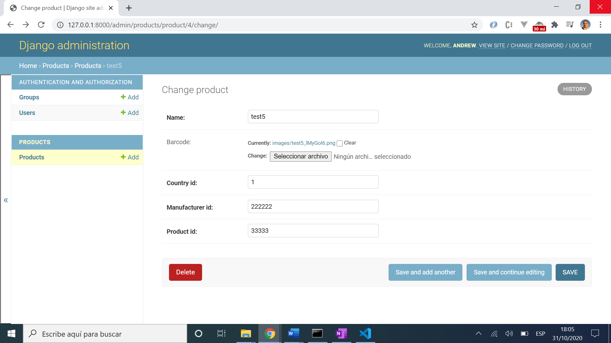
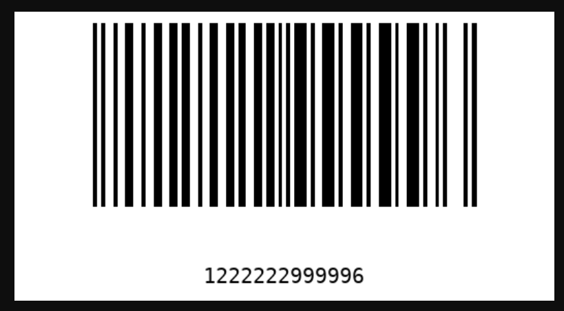

# :zap: Python Django BarCode

* Python-Django app to create & display barcodes
* Code from a tutorial by [Pyplane](https://www.youtube.com/channel/UCQtHyVB4O4Nwy1ff5qQnyRw) - see [:clap: Inspiration](#clap-inspiration) below
* **Note:** to open web links in a new window use: _ctrl+click on link_


## :page_facing_up: Table of contents

* [:zap: Python Django BarCode](#zap-python-django-barcode)
	* [:page_facing_up: Table of contents](#page_facing_up-table-of-contents)
	* [:books: General info](#books-general-info)
	* [:camera: Screenshots](#camera-screenshots)
	* [:signal_strength: Technologies](#signal_strength-technologies)
	* [:floppy_disk: Setup](#floppy_disk-setup)
	* [:computer: Code Examples](#computer-code-examples)
	* [:cool: Features](#cool-features)
	* [:clipboard: Status & To-do list](#clipboard-status--to-do-list)
	* [:clap: Inspiration](#clap-inspiration)
	* [:envelope: Contact](#envelope-contact)

## :books: General info

* Django framework admin dashboard lets user specify barcode fields. These are converted into a barcode using the `python-barcode` library function and displayed.

## :camera: Screenshots




## :signal_strength: Technologies

* [Python v3](https://www.python.org/) programming language
* [Django v3](https://www.djangoproject.com/) server-side web framework
* [python-barcode v0.13.1](https://pypi.org/project/python-barcode/) to create barcode. Supports barcode formats: EAN-8, EAN-13, EAN-14, UPC-A, JAN, ISBN-10, ISBN-13, ISSN, Code 39, Code 128, PZN
* [Pillow v8](https://pypi.org/project/Pillow/) Python Imaging Library (Fork)

## :floppy_disk: Setup

* [Install Python](https://docs.python-guide.org/starting/installation/)
* [Install pip](https://docs.python-guide.org/dev/virtualenvs/#installing-pipenv)
* [Install Django](https://docs.djangoproject.com/en/3.1/howto/windows/) by typing `pip install Django`
* Run `django-admin startproject barcode_proj` to create a new project [ref. docs](https://docs.djangoproject.com/en/3.1/intro/tutorial01/)
* Open `barcode_proj` in VS Code
* Run `python manage.py startapp products` to create Python module
* Add code
* Run `pip freeze` to see list of modules installed. [Ref. Docs](https://pip.pypa.io/en/stable/reference/pip_freeze/)
* Run `python manage.py makemigrations` for changes to models etc.
* Run `python manage.py migrate` to migrate the migration files.
* To add a superuser Run `python manage.py createsuperuser --username=joe --email=joe@example.com` [Ref. Docs](https://docs.djangoproject.com/en/3.1/topics/auth/default/)
* Run `python manage.py runserver` to run server on port 8000 and open /admin console

## :computer: Code Examples

* extract from `products/models.py` by [Pyplane](https://www.youtube.com/channel/UCQtHyVB4O4Nwy1ff5qQnyRw)  showing Product class with fields, a string representation of the product and the bar code

```python
class Product(models.Model):
    name = models.CharField(max_length=200)
    barcode = models.ImageField(upload_to='images/', blank=True)
    country_id = models.CharField(max_length=1, null=True)
    manufacturer_id = models.CharField(max_length=6, null=True)
    product_id = models.CharField(max_length=5, null=True)

    def __str__(self):
        return str(self.name)

    def save(self, *args, **kwargs):
        EAN = barcode.get_barcode_class('ean13')
        ean = EAN(f'{self.country_id}{self.manufacturer_id}{self.product_id}', writer=ImageWriter())
        buffer = BytesIO()
        ean.write(buffer)
        self.barcode.save(f'{self.name}.png', File(buffer), save=False)
        return super().save(*args, **kwargs)
```

## :cool: Features

* Django inbuilt packages - admin dashboard

## :clipboard: Status & To-do list

* Status: Working
* To-do: Comment code, complete readme. Change server config so it shows admin panel right away (so not necessary to add `/admin` to server path)

## :clap: Inspiration

* [Pyplane: Youtube: Django barcode generator | How to create barcodes in Django](https://www.youtube.com/watch?v=VDIJ4GgKxR8&t=102s)
* [python-barcode documentation](https://python-barcode.readthedocs.io/en/stable/barcode.html#creating-barcodes-as-image)
* [Medium: Shankar Jha: What makes Django cool?](https://medium.com/@shankarj67/what-makes-django-cool-5d7cad83de5c)

## :file_folder: License

* N/A

## :envelope: Contact

* Repo created by [ABateman](https://github.com/AndrewJBateman), email: gomezbateman@yahoo.com
